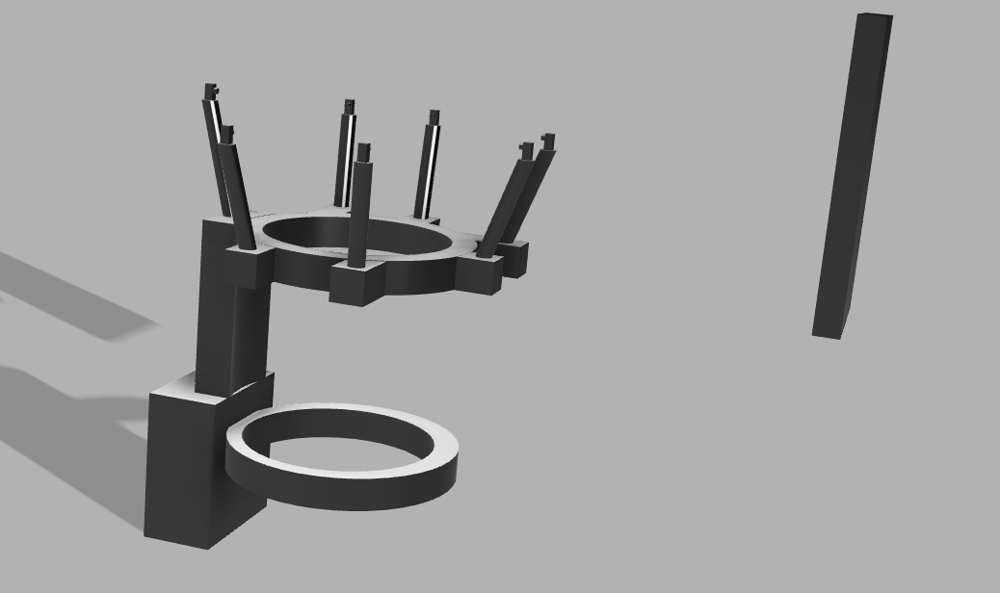

# Covid19_Hackathon

Developed hardware+software solution for do-it-yourself haircuts during quaritine. 

Hardware: Developed 3D model for head stabilizer with adjustable camera mounts.

Software: Developing app that uses video stream to give step-by-step instructions on where and how to cut your hair. 

Submission for Franklin Claure and Houston Claure

Repository files include:

1.) Submission video: https://youtu.be/7QnX4EAQSqg

2.) 3D Model

3.) Website Developed: https://franklinclaure184.wixsite.com/mysite

4.) Slideshow

